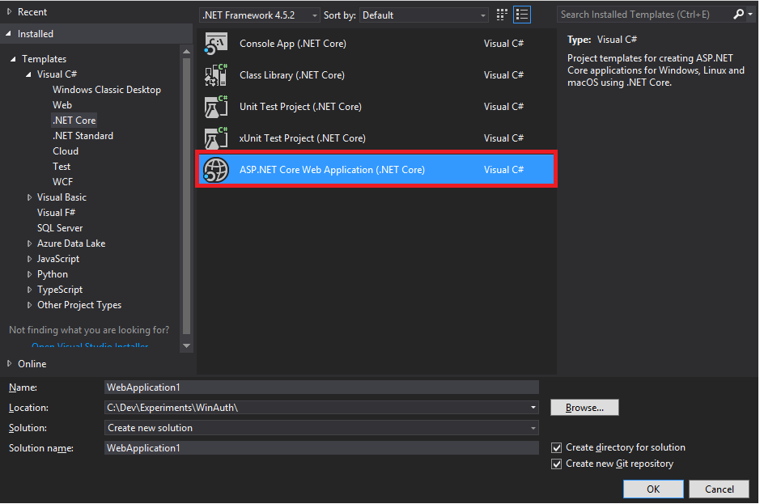
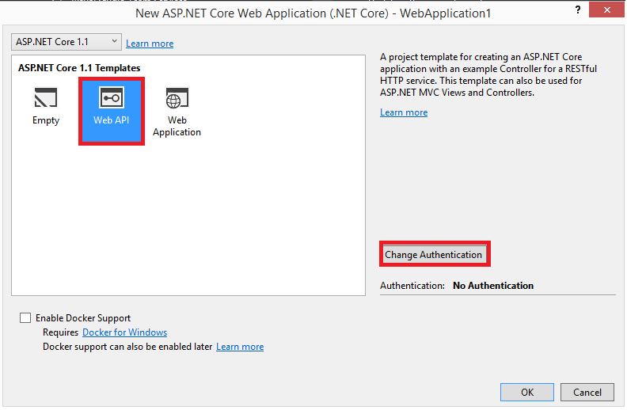
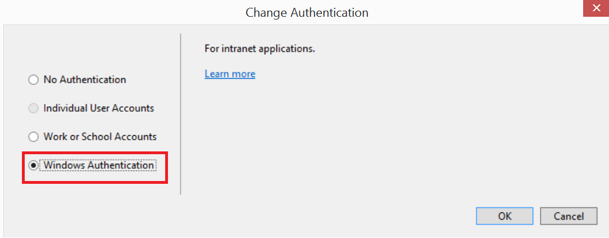
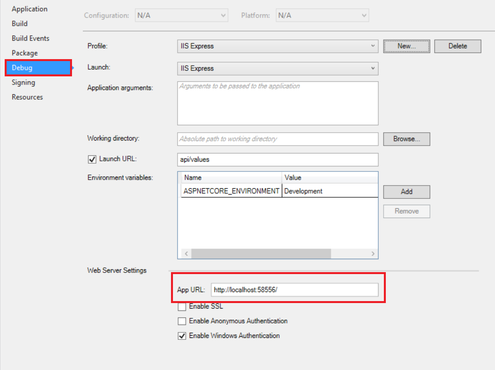
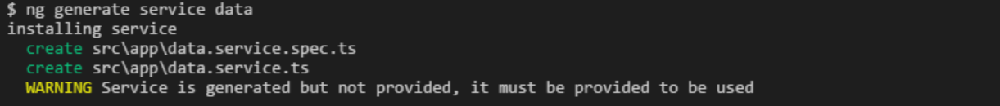

# Using windows authentication for an Angular project

## Creating the API

1. Open Visual Studio and create a new project



2. Choose **Web API** and then click on **Change Authentication**



3. Choose **Windows Authentication**



4. Add the **Microsoft.AspNetCore.StaticFiles** nuget package to your project.

5. Update the **Configure** method in `Startup.cs` so it looks like:

``` CSharp
public void Configure(IApplicationBuilder app, IHostingEnvironment env, ILoggerFactory loggerFactory)
{
    loggerFactory.AddConsole(Configuration.GetSection("Logging"));
    loggerFactory.AddDebug();

    app.UseMvc();
    app.UseDefaultFiles();
    app.UseStaticFiles();
}
```

6. Update the **Get** method in `ValuesController.cs` so it looks like:

``` CSharp
[HttpGet]
public IEnumerable<string> Get()
{
    return new [] { "value1", "value2", User.Identity.Name };
}
```

## Creating the UI

### Prerequisite - you'll need to have node and the @angular/cli installed before starting this bit

Since the API and UI projects will be run on separate ports during development, we need to set up a proxy to our API.  The following steps show how to do this.

1. Open up a command prompt and create a new angular application using `ng new PROJECT-NAME`.  Go to [Angular CLI](https://github.com/angular/angular-cli) for further information on how to use this tool.

2. Go back to your Visual Studio project for a moment, right click on the project, and go to Properties, then chooose the Debug menu and make a note of the App URL.



3. Create a `proxy.conf.js` file in the root of the Angular project and add the following contents, ensuring you set the `target` property's value to the App URL:

``` JavaScript
const Agent = require('agentkeepalive');

module.exports = {
    '/api': {
        target: 'http://localhost:58556',
        secure: false,        
        agent: new Agent({
            maxSockets: 100,
            keepAlive: true,
            maxFreeSockets: 10,
            keepAliveMsecs: 100000,
            timeout: 6000000,
            keepAliveTimeout: 90000
        }),
        onProxyRes: proxyRes => {
            let key = 'www-authenticate';
            proxyRes.headers[key] = proxyRes.headers[key] &&
                proxyRes.headers[key].split(',');
        }
    }
};
```

4. At the command prompt, run `npm install agentkeepalive --save-dev`.  This is a **development-only** depedency to get the proxying working.

4. Open the `package.json` file and update the `start` script to:

``` JSON
"start": "ng serve --proxy-config proxy.conf.js",
```

5. Create a data service by running the following at the command prompt `ng generate service data`;

6. You might see a warning after generation has completed 



If you do, go to your `app.module.ts` and modify it to look like:

``` TypeScript
import { BrowserModule } from '@angular/platform-browser';
import { NgModule } from '@angular/core';
import { HttpModule } from '@angular/http';

import { DataService } from './data.service';
import { AppComponent } from './app.component';

@NgModule({
  declarations: [
    AppComponent
  ],
  imports: [
    BrowserModule,
    HttpModule
  ],
  providers: [DataService],
  bootstrap: [AppComponent]
})
export class AppModule { }
```

6. Alter the contents of `data.service.ts` to look like:

``` TypeScript
import { Injectable } from '@angular/core';
import { Http } from '@angular/http';

import 'rxjs/Rx';

@Injectable()
export class DataService {
  constructor(private http: Http) { }

  getValues() {
    return this.http
      .get('/api/values')
      .map(res => res.json());
  }
}

```

7. Alter the content of `app.component.ts` to look like:

``` TypeScript
import { Component, OnInit } from '@angular/core';
import { DataService } from './data.service';

import { Observable } from 'rxjs/Observable';

@Component({
  selector: 'app-root',
  templateUrl: './app.component.html',
  styleUrls: ['./app.component.css']
})
export class AppComponent implements OnInit {
  values: string[];

  constructor(private dataService: DataService) { }

  ngOnInit(): void {
    this.dataService
      .getValues()
      .subscribe(
        values => this.values = values,
        error => console.log(error)
      );
  }
}
```

8. Alter the contents of `app.component.html` to look like:

``` HTML
<h1>Values from API</h1>

<ng-template #loading>
  Loading ...
</ng-template>

<ul *ngIf="values; else loading">
  <li *ngFor="let value of values">{{value}}</li>
</ul>
```

9. Ensure you have the Api project running and then at the command prompt, enter `npm start`.

10. Open up a browser at [http://localhost:4200](http://localhost:4200).  You should see the static values of value1 and value2 along with your username.

## Working example

See the [example](example) folder.